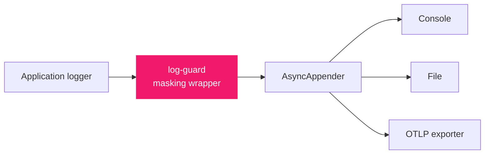
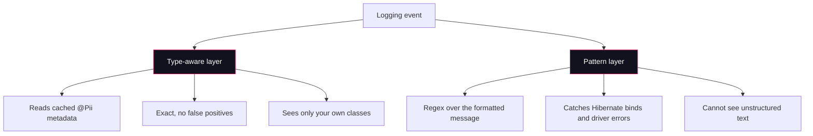

<div align="center">

<picture>
  <source media="(prefers-color-scheme: dark)" srcset="docs/assets/wordmark-dark.svg">
  
</picture>

**Personal data never reaches the appender.**

A Spring Boot starter that masks personal data at the Logback event level,
so console, file and OTLP exports all see the same redacted output.

[](https://central.sonatype.com/artifact/io.github.dancan254/log-guard-spring-boot-starter)
[](LICENSE)
[](https://openjdk.org/projects/jdk/25/)
[](https://spring.io/projects/spring-boot)

</div>

---

## The problem

Every logging framework will print whatever you hand it. An entity with a generated `toString`
puts a customer's email, phone number and date of birth into your log aggregator, and nobody
notices until an audit.

```java
@Entity
@Data
public class Customer {
    @Id private Long id;
    private String email;
    private String phoneNumber;
    private LocalDate dateOfBirth;
}

log.info("Registered customer {}", customer);
```

```
Registered customer Customer(id=3, email=jane.wanjiru@acme.io, phoneNumber=+254712345891, dateOfBirth=1994-07-02)
```

Annotate the fields, add the starter, and the same statement produces this instead. The output
below is pasted from a run of the demo module, not from documentation.

```java
@Pii(strategy = HASH)    private String email;
@Pii(strategy = PARTIAL) private String phoneNumber;
@Pii                     private LocalDate dateOfBirth;
```

```
Registered customer Customer(id=3, email=#47f5f4, phoneNumber=+2547****244, dateOfBirth=***, city=Kisumu)
```

## Why the event and not the layout

Most redaction libraries rewrite the pattern layout. That protects the console and nothing else.
The OpenTelemetry Logback appender reads `event.getFormattedMessage()` directly, so a layout filter
leaves your OTLP pipeline carrying the raw values.

log-guard masks the logging event itself, above the async boundary, so every appender downstream
receives the same redacted text.



Masking still runs on the async worker rather than the request thread, because the wrapped event
masks lazily.

## Installation

```xml
<dependency>
    <groupId>io.github.dancan254</groupId>
    <artifactId>log-guard-spring-boot-starter</artifactId>
    <version>0.1.0</version>
</dependency>
```

Requires Java 25 and Spring Boot 4. Logback comes from your application. There is no appender to
declare and nothing to switch on.

## Quick start

**1. Annotate the fields that hold personal data.**

```java
public record Customer(
        Long id,
        @Pii(strategy = MaskStrategy.HASH)    String email,
        @Pii(strategy = MaskStrategy.PARTIAL) String phoneNumber,
        @Pii                                  LocalDate dateOfBirth,
        String city) {
}
```

**2. Set a salt, because this example uses `HASH`.**

```yaml
log-guard:
  hash-salt: ${LOG_GUARD_SALT}
```

**3. Log the object.**

```java
log.info("Registered customer {}", customer);
```

That is the whole integration. `smoke/verify.sh` in this repository builds a Boot application with
that one dependency and asserts both masking layers run.

## Two layers, both necessary



The type-aware layer is precise but only knows about classes you annotated. The pattern layer
covers output from code you do not own. Hibernate's bind-parameter trace and a driver's own
exception message are both real leak paths that no annotation can reach:

```
org.hibernate.orm.jdbc.bind - binding parameter (3:VARCHAR) <- [***]

Caused by: java.sql.SQLException: duplicate key value violates unique
constraint: Key (email)=(***) already exists
```

Both layers are enabled by default.

## What gets masked

Five channels on every event, because personal data leaks from all of them.

| Channel | Example |
| :--- | :--- |
| `getArgumentArray()` | `log.info("{}", customer)` |
| `getFormattedMessage()` | the rendered line, scanned by the pattern layer |
| `getMDCPropertyMap()` | `MDC.put("userEmail", ...)` |
| `getKeyValuePairs()` | `atInfo().addKeyValue("email", ...)` |
| `IThrowableProxy` | a constraint violation quoting the offending value |

The throwable channel is the subtle one. The OpenTelemetry appender exports an exception only when
it can pull a real `Throwable` from the event, so log-guard hands it a masked stand-in. An exception
whose chain held nothing to mask is passed through untouched, which keeps `exception.type` exact
wherever masking changed nothing.

## Masking strategies

| Strategy | Output | Use for |
| :--- | :--- | :--- |
| `REDACT` (default) | `***` | Values with no analytical use |
| `PARTIAL` | `j****@example.com`, `+2547****244` | Support staff need to recognise the record |
| `HASH` | `#47f5f4` | Correlating a user across log lines without storing the value |
| `DROP` | field omitted entirely | Fields that should never appear |

`PARTIAL` is length aware, because a mask that shrinks with its input leaks the input:

* Contains `@`: first character, `****`, then everything from the `@`.
* 12 characters or more: first 5, `****`, last 3.
* 8 to 11 characters: `****`, last 3.
* Shorter than 8: falls back to `***`, since there is not enough length to hide anything in.

`HASH` is a salted SHA-256 truncated to 6 hex characters, stable across lines and instances so one
user stays correlatable. It requires `log-guard.hash-salt`. Rotating the salt breaks correlation
with older logs, which is the intended trade. Treat the salt as a secret and inject it.

With a blank salt, `MissingHashSaltException` is thrown at startup for a custom pattern using
`HASH`, and for an `@Entity` class using `HASH` when the startup validator finds it. Outside those
cases the value falls back to `***`, so set the salt whenever you use `HASH` and leave the
validator enabled.

## The `@Pii` annotation

```java
@Pii(strategy = MaskStrategy.PARTIAL, category = PiiCategory.PERSONAL)
```

It applies to a field or a record component. Both attributes are optional, and a bare `@Pii` means
`REDACT` and `PERSONAL`.

`category` does not change the output. It is metadata for your own auditing, recording which fields
hold financial data and which hold credentials. Values are `PERSONAL` (default), `SENSITIVE`,
`FINANCIAL`, `HEALTH` and `CREDENTIAL`.

A class is rendered field by field only when it carries at least one `@Pii`. Everything else is left
to its own `toString()`.

> **Note**
> Lombok's `@ToString.Exclude` is source retained and invisible at runtime, so it cannot hide a
> field from log-guard. Use `@Pii(strategy = DROP)` instead.

## Nested objects

An annotated object inside another object is rendered recursively across objects, arrays,
collections and maps, with three limits that stop a log statement becoming a graph traversal:

* Depth of 3.
* 10 elements per collection or array.
* An identity cycle guard, so a bidirectional JPA relationship terminates.

Reflection only enters classes that carry `@Pii`. A class with no annotation of its own is still
rendered when one of its declared field types carries `@Pii`, because a field typed `Object` hides
whatever it actually holds.

```yaml
log-guard:
  nesting:
    base-packages: [com.example.domain]
```

## Pattern masking

| Pattern | Matches | Default |
| :--- | :--- | :--- |
| `EMAIL` | addresses | Enabled |
| `IBAN` | international bank account numbers | Enabled |
| `CREDIT_CARD` | 13 to 19 digits, Luhn checked | Enabled |
| `PHONE_E164` | `+` followed by 8 to 15 digits | Enabled |
| `KENYAN_NATIONAL_ID` | 7 or 8 digit runs | Disabled |

`KENYAN_NATIONAL_ID` is off by default because a bare 7 or 8 digit run is also an order number, a
row count and a port. Enable it only where you know your log lines.

```yaml
log-guard:
  patterns:
    built-in: [EMAIL, IBAN, CREDIT_CARD, PHONE_E164, KENYAN_NATIONAL_ID]
    custom:
      - name: employee-id
        regex: "EMP-\\d{6}"
        strategy: REDACT
```

Two safety properties are worth understanding. A flat ASCII prefilter runs first, so a line
containing no trigger character never reaches a regex, which is why a clean line costs 126 ns rather
than microseconds. And `max-message-length` (8192) caps what is scanned. Past the cap the head is
masked and the tail is replaced with a truncation notice, with the cut moved back to a token
boundary so a value straddling the limit cannot escape as an unmatched fragment. It fails closed,
because skipping the regex on long input is a leak anyone can trigger by padding a field.

## The startup validator

At startup log-guard scans `@Entity` classes in your own packages and reports any class that
declares a `toString()` and holds a field whose name is in the personal data taxonomy but carries no
`@Pii`. Inherited fields are included, so the usual `@MappedSuperclass` layout is covered. It reads
annotations by name through Spring's metadata reader, so the starter needs no JPA dependency.

```yaml
log-guard:
  validation:
    unannotated-entity: WARN   # OFF | WARN | FAIL
```

Set `FAIL` in CI and a new unannotated `email` column cannot reach production.

## Configuration reference

```yaml
log-guard:
  enabled: true
  hash-salt: ""                 # required if any field uses HASH
  on-failure: PLACEHOLDER       # or DROP, PASSTHROUGH
  type-aware:
    enabled: true
  patterns:
    enabled: true
    built-in: [EMAIL, IBAN, CREDIT_CARD, PHONE_E164]
    max-message-length: 8192
    custom: []                  # name, regex, strategy
  mdc:
    redact-keys: []             # emptied whatever they hold, matched case insensitively
  nesting:
    max-depth: 3
    max-elements: 10
    base-packages: []           # empty means any class carrying @Pii
  validation:
    unannotated-entity: WARN    # or FAIL for CI, OFF to skip
```

`on-failure` decides what an appender does with an event log-guard could not mask.

| Mode | Behaviour |
| :--- | :--- |
| `PLACEHOLDER` (default) | Keep the event, replace its payload with a notice. Never leaks, never silent. |
| `DROP` | Discard the event. Choose this when a leak matters more than a missing line. |
| `PASSTHROUGH` | Emit unmasked. Only when the log is already inside your trust boundary. |

## Recipes

### Exporting to OpenTelemetry

Boot's OTel starter exports signals but never hands the SDK to the Logback appender, and
`OpenTelemetryAppender.install()` inspects only a logger's top level appenders, so it cannot see one
that log-guard has wrapped. Hand it over through the wrapper.

```java
@Configuration
@ConditionalOnClass(name = "ch.qos.logback.classic.LoggerContext")
public class OpenTelemetryLogbackBridge {

    private final OpenTelemetry openTelemetry;

    public OpenTelemetryLogbackBridge(OpenTelemetry openTelemetry) {
        this.openTelemetry = openTelemetry;
    }

    @EventListener(ApplicationReadyEvent.class)
    void install() {
        OpenTelemetryAppender.install(openTelemetry);
        if (!(LoggerFactory.getILoggerFactory() instanceof LoggerContext loggerContext)) {
            return;
        }
        loggerContext.getLoggerList().forEach(logger ->
                logger.iteratorForAppenders().forEachRemaining(this::installIntoWrapped));
    }

    private void installIntoWrapped(Appender<ILoggingEvent> appender) {
        if (appender instanceof MaskingAppenderWrapper wrapper
                && wrapper.getDelegate() instanceof OpenTelemetryAppender otelAppender) {
            otelAppender.setOpenTelemetry(openTelemetry);
        }
    }
}
```

### Log4j2 instead of Logback

Log4j2's extension point is a `RewritePolicy` rather than appender wrapping, so the adapter differs
while the engine does not.

```xml
<dependency>
    <groupId>io.github.dancan254</groupId>
    <artifactId>log-guard-log4j2</artifactId>
    <version>0.1.0</version>
</dependency>
```

Put every appender behind the rewrite, so none of them sees the raw event.

```xml
<Rewrite name="MASKED">
    <LogGuardRewritePolicy/>
    <AppenderRef ref="CONSOLE"/>
</Rewrite>
```

Two differences apply on this backend. Key value pairs are masked by the pattern layer alone,
because SLF4J's Log4j2 binding stores pairs as `Map<String, String>` and calls `String.valueOf`
inside `addKeyValue`, so no object survives to the rewrite point. Naming the key in
`log-guard.mdc.redact-keys` closes that gap. Separately, OTLP log export does not follow you here,
because the bridge above is conditional on Logback being present. Log arguments are unaffected and
stay type aware on both backends.

### JSON encoded logs

```java
ObjectMapper logMapper = JsonMapper.builder()
        .addModule(new LogGuardModule(hashSalt))
        .build();
```

Register it on a mapper you build for logging. The module is deliberately not auto registered,
because adding it to your application's primary mapper would silently mask REST responses.

### Redacting MDC keys wholesale

```yaml
log-guard:
  mdc:
    redact-keys: [userEmail, sessionToken]
```

Matched without regard to case, and emptied whatever they hold.

## Try it

The repository ships a runnable demo with a Boot application, Postgres and an OpenTelemetry
collector, so the masking can be watched rather than taken on trust. Docker is required.

```bash
./mvnw -pl log-guard-demo spring-boot:run     # listens on 8081
```

In a second terminal, watch what actually leaves the process:

```bash
docker compose -f log-guard-demo/compose.yaml logs -f otel-collector
```

That second terminal is the one that matters. Masking a console is easy. The claim worth checking is
that OTLP carries the same redacted text.

```bash
curl -s -X POST localhost:8081/customers \
  -H 'Content-Type: application/json' \
  -d '{"email":"jane.wanjiru@acme.io","phoneNumber":"+254712345891",
       "nationalId":"31234567","dateOfBirth":"1994-03-11","city":"Nairobi"}'

curl -s localhost:8081/leaks/mdc        # MDC map
curl -s localhost:8081/leaks/kv         # key value pairs
curl -s localhost:8081/leaks/exception  # throwable chain
curl -s localhost:8081/leaks/nested     # nested object in an unannotated wrapper
```

To see the difference rather than trust it, run the same requests with masking disabled and compare
both the console and the collector.

```bash
./mvnw -pl log-guard-demo spring-boot:run \
  -Dspring-boot.run.arguments=--log-guard.enabled=false
```

## Limitations

* Anything logged before the starter installs, such as Boot's banner and its own first startup
  lines, is outside reach.
* A bare name in a plain string is undetectable by either layer.
* On Log4j2, SLF4J key value pairs arrive as strings and receive the pattern layer only.
* Span exceptions never pass through a logging backend, so Micrometer exports them unmasked even
  though the same text is masked in the logs.
* This is not a compliance guarantee and not a static scanner. It changes what reaches the appender
  at runtime and never reads your code.

## Performance

JMH, via `./mvnw -Pbench -pl log-guard-benchmarks verify`. The numbers below come from a loaded
developer laptop (JDK 25, 12 cores, other containers running), so read them as an order of magnitude
and as a comparison between rows rather than a specification.

| Benchmark | ns/op |
| :--- | ---: |
| Argument with no `@Pii` anywhere (the common case) | **8** |
| A log line with nothing to mask, through the pattern layer | **126** |
| Rendering an annotated 6 field entity | 1,519 |
| Rendering a 20 field entity | 1,614 |
| Rendering a list of three annotated entities | 4,745 |
| A line that does contain an email, masked | 7,137 |
| Both layers together on one event | 25,452 |

The first row is the one that matters. An argument whose class carries no `@Pii` costs a
`ClassValue` lookup and nothing else.

CI runs the same benchmarks on every push with fewer forks and iterations, then checks each score
against a ceiling in `log-guard-benchmarks/check-thresholds.sh`. The ceilings sit about ten times
above the numbers above, because a shared runner cannot produce a publishable measurement and a
benchmark that fails on noise gets deleted within a month.

## Modules

| Module | Purpose |
| :--- | :--- |
| `log-guard-core` | `@Pii`, strategies, masking engine. Zero dependencies. |
| `log-guard-logback` | Logback appender wrapping. |
| `log-guard-spring-boot-starter` | Auto-configuration, properties, startup validator. |
| `log-guard-log4j2` | `RewritePolicy` for applications on Log4j2. |
| `log-guard-jackson` | Jackson module for JSON encoded logs. |
| `log-guard-benchmarks` | JMH harness. Never published, `-Pbench` only. |

Core is Spring free and dependency free, and stays that way. A privacy library with a transitive
dependency tree is a harder sell to the team that has to approve it.

## Building

```bash
./mvnw test        # unit and Testcontainers integration tests (Docker required)
./mvnw package     # module jars
```

Architecture record: [`docs/ARCHITECTURE.md`](docs/ARCHITECTURE.md).

## Licence

Apache-2.0. See [LICENSE](LICENSE).
